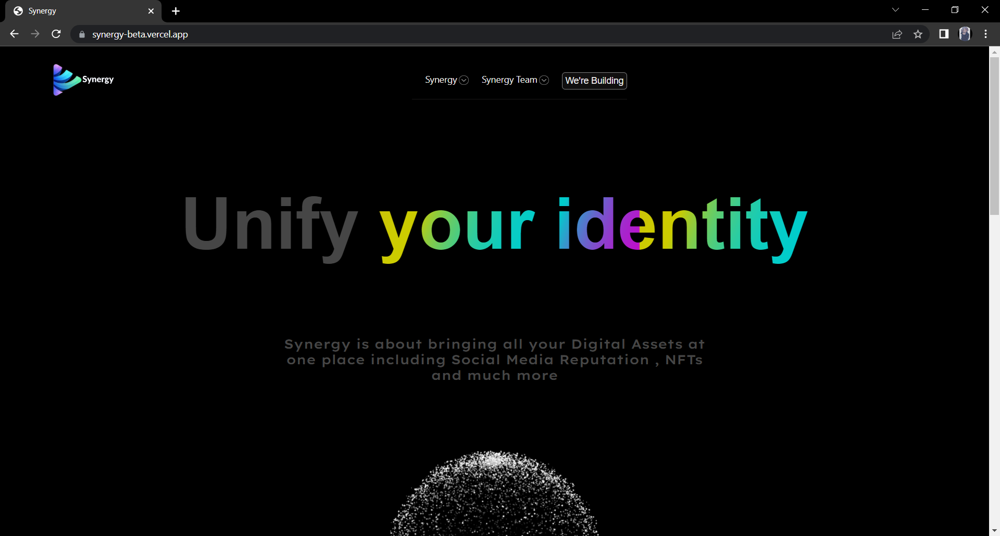
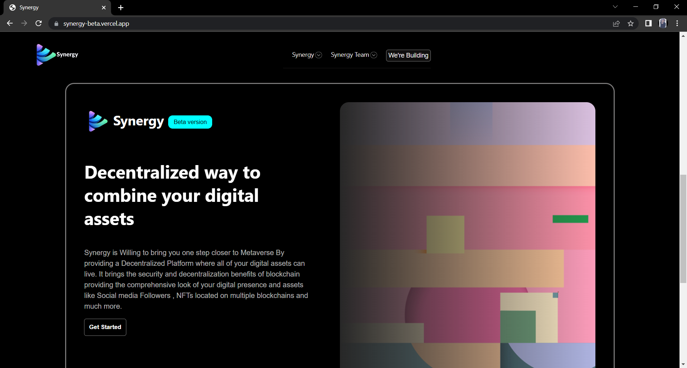
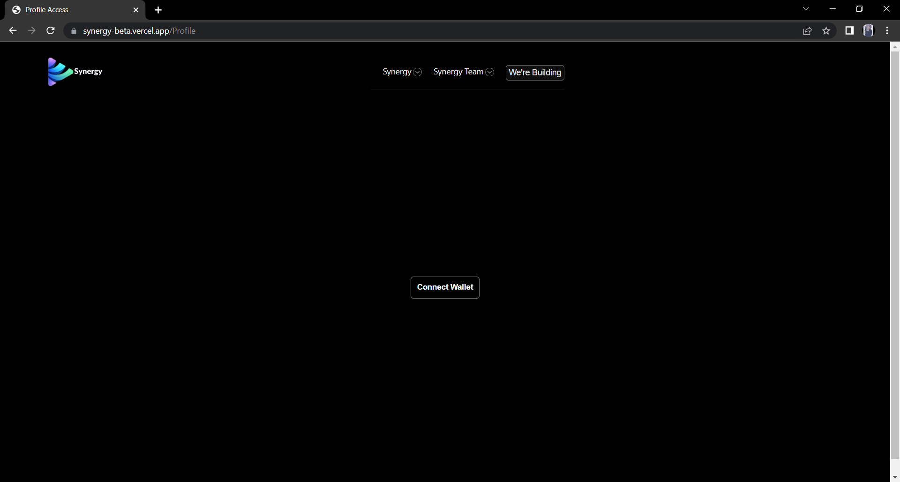
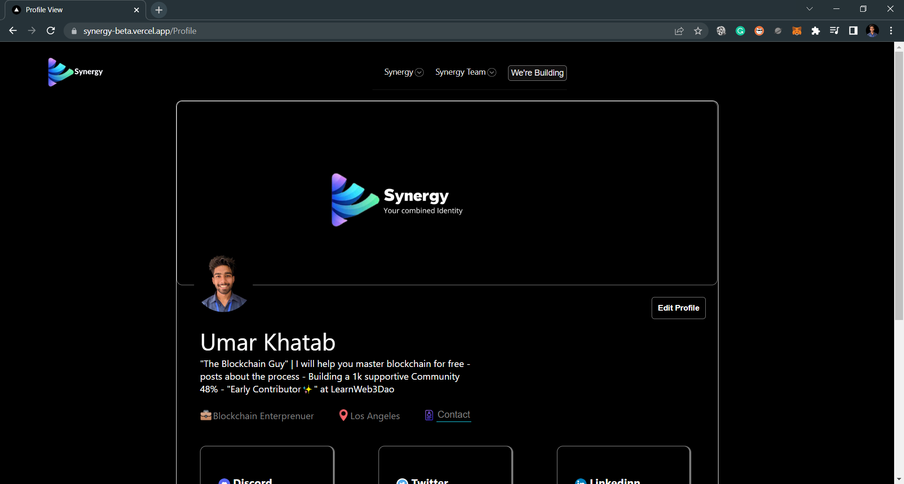
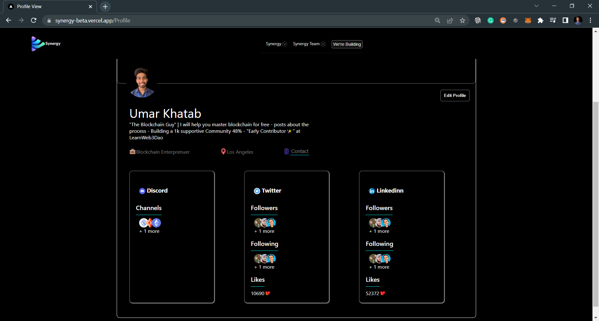

# Synergy 
### A place to aggregate your social media presence at one place on a Decentralized Storage ` Ceramic `

## Tech Stack 🔰

    ⭕ Next Js
    ⭕ Ceramic Self.ID
    ⭕ Ethers Js
    ⭕ CSS Modules
    
## Flow of App ♻

    ✅ User Visits Synergy Homepage 
    ✅ Click on Get Started button
    ✅ Connect the Wallet
    ✅ Allows Ceramic Self ID to connect with Wallet
    ✅ New Account ( Empty ) or Existing Account is Loaded
    ✅ User Can Edit the information of the profile
    ✅ User can view the profile
  
  

## Limitations 💥

    🔱 Not completed
    🔱 Just aggregating different social media and not serving the real use case
    🔱 Not worth to be a profuct but worth building for practice
  
### Project illustration  

  
## Live Link

You can can check the project live here at https://synergy-beta.vercel.app/
